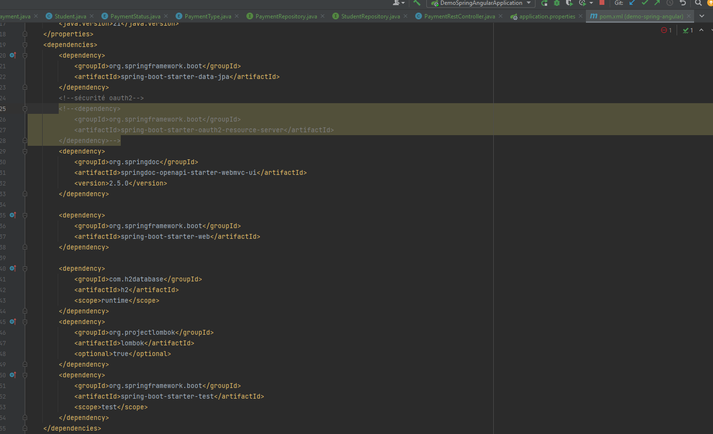
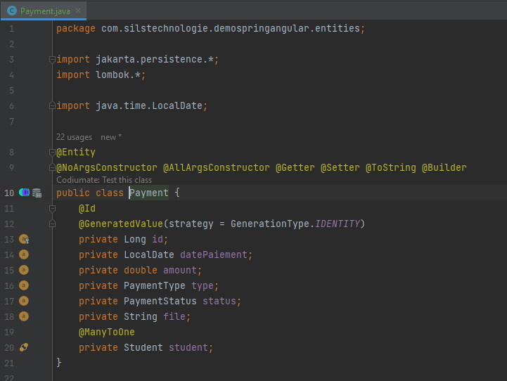
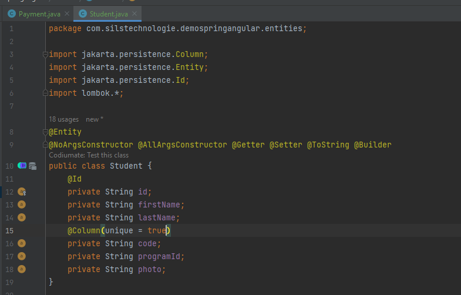
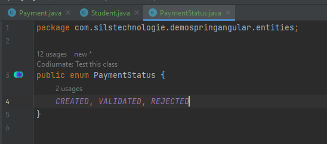
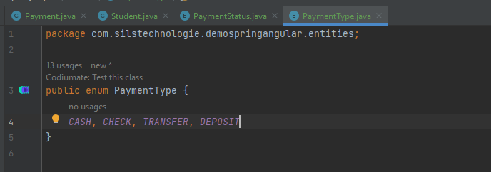
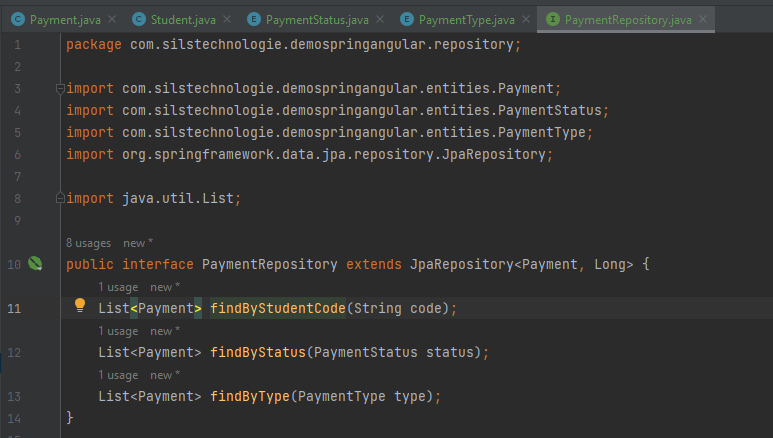
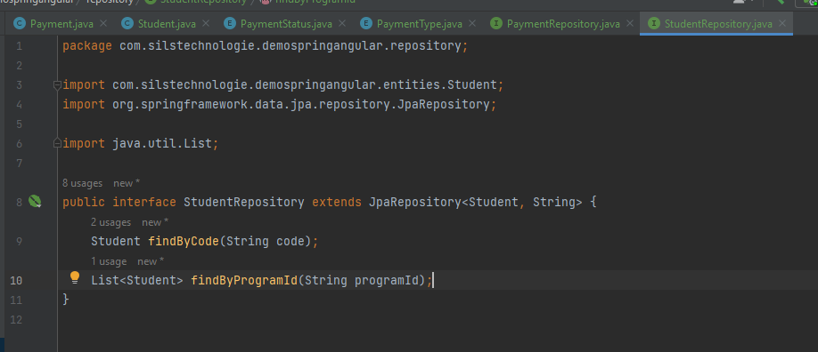
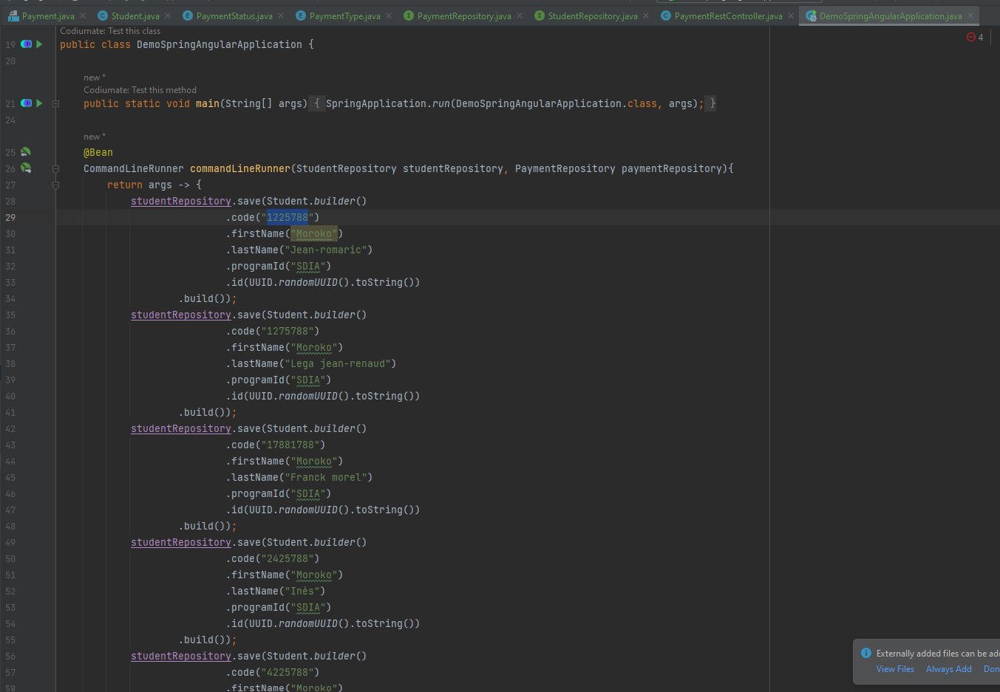
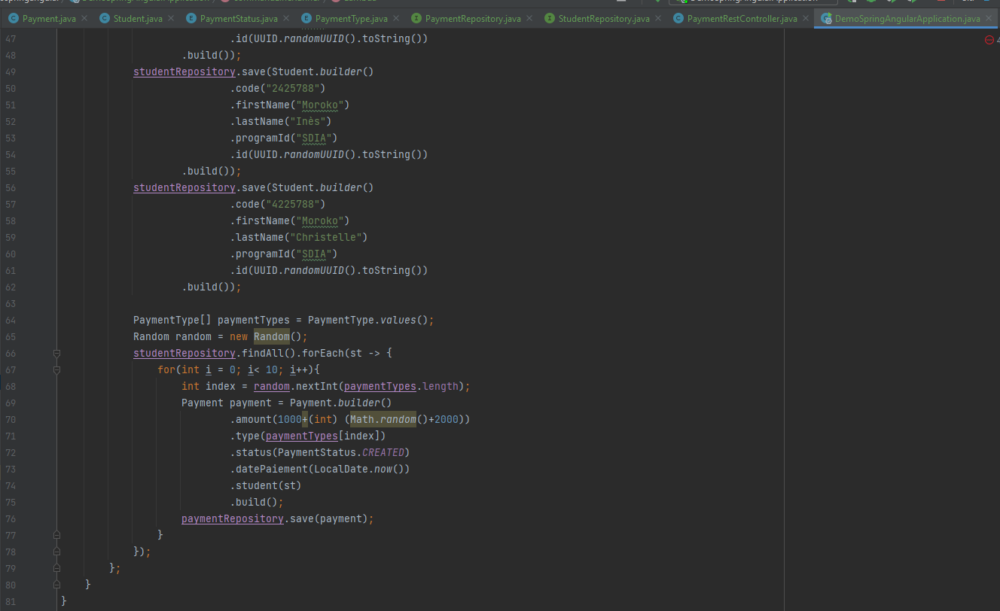
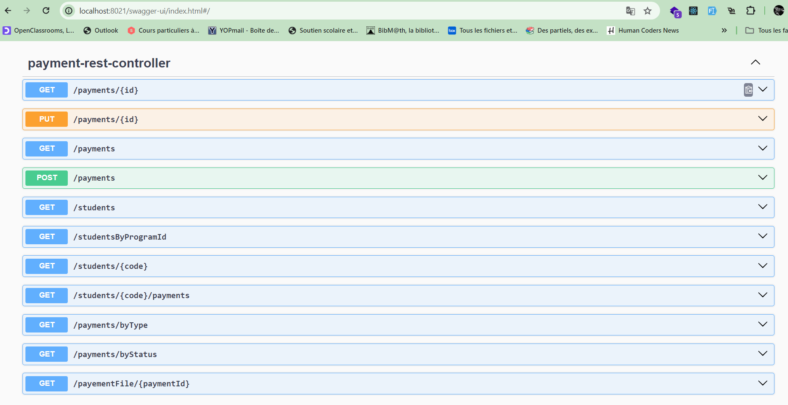

<h2>Application spring boot</h2>
1- Création du projet 
  
2- Creation des entités JPA 

3- Creation des interfaces JPA 
  
  
4-Génération des données aléatoire  

  
5-Création du web service restfull  

  
6- Tester le backend avec swagger 
    6.1- Ajout de la dépendance de swagger 
    6.2- Test 
  
